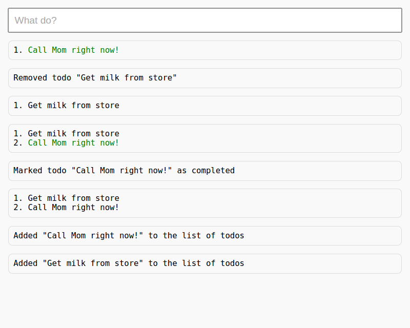

# Embedding

One of clip's strengths is its support for *embedded* applications. An embedded application is one which is not run directly from the command line, but is "hooked in" to a larger project.

In this section we will look at the creation of a simple Python-backed todo website using clip. You can see the full sources in the `examples/todo/` directory of this repository.

## The Client

Since the purpose of this section is not to create a flashy website, we'll keep things dead simple for the HTML:

```html
<input id="input" type="text" placeholder="What do?">
<div id="output"></div>
```

We have a single input box, in which users can enter text commands, and a single output div, in which responses from the server will be posted. Now on to the JavaScript:

```js
var sock = new SockJS('http://localhost:8080/todo');
sock.onmessage = function(e) {
	var message = e.data;
	var output = document.getElementById('output');
	output.innerHTML = "<p>" + message.replace(new RegExp('\n', 'g'), '<br>') + "</p>" + output.innerHTML;
};
document.getElementById('input').onkeypress = function(e) {
	// Enter pressed?
	if (e.keyCode === 10 || e.keyCode === 13) {
		input = this.value;
		this.value = '';
		sock.send(input);
	}
};
```

Here we use the [SockJS](https://github.com/sockjs/sockjs-client) protocol to simplify communication between the client and server. All communication is mounted on the `/todo` route. We attach an event listener to our input -- when the enter key is pressed, we send the input to the server through our SockJS socket. When a response is received, we prepend it to the output div.

## Server Utilities

Our server is powered by the [Tornado web framework](http://www.tornadoweb.org/en/stable/) and linked to our client via [SockJS-tornado](https://github.com/mrjoes/sockjs-tornado). Before we can get to implementing the todo-app functionality, we have to write a few utility classes.

### Stream

```python
class Stream(object):
	def __init__(self, f):
		self._f = f

	def write(self, message):
		self._f(message)
```

A stream is simply a Python class that implements a `write()` method: `sys.stdout` is one such stream, and most Python file utilities are abstractions of this model, which is why you can redirect output to a file so easily. Our custom stream takes a function `f` in its constructor and calls this function when it receives a message, in effect "wrapping" the function. You'll see why this has to be done in a minute.

### Todo

```python
class Todo(object):
	def __init__(self, item):
		self._item = item
		self._completed = False

	def complete(self):
		self._completed = True

	def get_str(self):
		return '<span class="completed">{}</span>'.format(self._item) if self._completed else self._item
```

We keep things simple for our `Todo` class. Each todo is an `item` (a string describing the todo), and may be `completed`.

### Serving our `index.html`

```python
class IndexHandler(web.RequestHandler):
	def get(self):
		self.render('index.html')
```

We need a simple `RequestHandler` to serve our HTML.

## The Backend

Now we're ready to make the meat of our app: the application backend, powered by clip. It's always helpful to start by writing some scaffolding for our SockJS socket handler:

```python
class TodoConnection(SockJSConnection):

	def on_open(self, info):
		# @TODO

	def on_message(self, message):
		# @TODO

	def on_out(self, message):
		self.send(message)

	def on_err(self, message):
		self.send('<span class="error">{}</span>'.format(message))
```

The `on_open()` and `on_message()` methods are internal to SockJS, and are called when a connection is opened by the client and when a client message is received, respectively. We'll get to those in a bit.

We've also defined two other methods to handle our custom out and error streams. They both send a message through our socket. The error method wraps the message in some HTML marking it as an error before doing so.

### `on_open()`

So how do we let clip know about these custom stream handler methods if they're part of our `TodoConnection` class? Well...

```python
self._todos = []
self._app = clip.App(stdout=Stream(self.on_out), stderr=Stream(self.on_err))
```

A lot of new things are going on here. First, we're storing our app *in* the `TodoConnection` class. Second, we're specifying our custom streams as arguments to `clip.App()`. This will create an application that uses these streams instead of `sys.stdout` and `sys.stderr` for everything it does. Remember that a stream has to implement the `write()` method, which is why we actually wrap our `on_out()` and `on_err()` handlers in our utility stream class defined earlier.

### The App

With that out of the way, we can write our app like normal. All this code is part of `on_open()` (yes, we're nesting functions, Python is cool like that).

```python
@self._app.main()
def todo():
	pass

@todo.subcommand()
@clip.arg('desc', nargs=-1, required=True)
def add(desc):
	desc = ' '.join(desc)
	self._todos.append(Todo(desc))
	clip.echo('Added "{}" to the list of todos'.format(desc))

@todo.subcommand()
@clip.arg('index', type=int, required=True)
def remove(index):
	try:
		removed = self._todos.pop(index - 1)
		clip.echo('Removed todo "{}"'.format(removed._item))
	except IndexError:
		clip.exit('Invalid todo index given', True)

@todo.subcommand()
@clip.arg('index', type=int, required=True)
def complete(index):
	try:
		completed = self._todos[index - 1]
		completed.complete()
		clip.echo('Marked todo "{}" as completed'.format(completed._item))
	except IndexError:
		clip.exit('Invalid todo index given', True)

@todo.subcommand(name='list')
@clip.flag('-a', '--active')
def list_todos(active):
	l = [e for e in self._todos if not e._completed] if active else self._todos
	clip.echo('\n'.join(['{}. {}'.format(i + 1, e.get_str()) for i, e in enumerate(l)]))
```

This functionality should be pretty straightforward. Users can do one of four things:

1. Add a todo to the list
2. Remove a todo from the list by giving its index
3. Mark a todo as complete by giving its index
4. List todos, either all of them or only the active (not completed) ones

The difference is that now, whenever `clip.echo()` or `clip.exit()` is used, the output gets routed to `on_out()` and `on_err()` and subsequently gets sent to the client.

### `on_message()`

Now all that's left is to handle receiving input from the client:

```python
try:
	self._app.run(message)
except clip.ClipExit:
	pass
```

This should look familiar.

## Starting Our Server

This part has nothing to do with embedding clip, but we'll go over it for the sake of completeness:

```python
if __name__ == '__main__':
	TodoRouter = SockJSRouter(TodoConnection, '/todo')
	web.Application(
		[(r'/', IndexHandler)] + TodoRouter.urls
	).listen(8080)
	ioloop.IOLoop.instance().start()
```

Here we mount our `TodoConnection` to the `/todo` route so that our client can connect to it. We then create a web application listening on port `8080` and start it.

## The Result



The following commands were run, in order from bottom to top:

```
add Get milk from store
add Call Mom right now!
list
complete 2
list
list --active
remove 1
list
```

You might notice that what we've basically done is created an in-browser shell in less than 100 lines of Python and 20 lines of JavaScript. Not bad.
