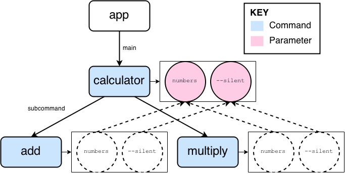

> **NOTE**: This section is intended for those who want to understand the inner workings of clip. If you just want to *use* clip, you can stop reading right now. On the other hand, if you want to contribute to clip development, read on!

Handling command line input seems deceptively simple up front: it's just a string of tokens, right? However, there are many things that can go wrong and, perhaps even worse, many subtleties to CLI token parsing that complicate the matter a thousand-fold.

Here, we will illustrate how clip works by walking through a single invocation of our [Super Mario Calculator](inheriting-parameters.md) program:

```diff
$ python calculator.py -s add 1 3 5 7
```

Ready? Great, let's get started!

## Step 1: Building the CLI

Before we can even think about parsing user input, we have to build our CLI up from its decorated functions (if you need a refresher on decorators, I recommend [this excellent tutorial](http://simeonfranklin.com/blog/2012/jul/1/python-decorators-in-12-steps/)). Let's take a look at how this is done for the main function of our calculator:

```python
@app.main()
@clip.arg('numbers', nargs=-1, type=int, inherit_only=True)
@clip.flag('-s', '--silent', inherit_only=True)
def calculator():
	pass
```

The first hurdle is that decorators are evaluated inside-out. That is, the `--silent` flag will be evaluated first because it is "closest" to our `calculator()` function. This makes sense because decorators wrap functions, so like a set of [Matryoshka dolls](http://en.wikipedia.org/wiki/Matryoshka_doll) we have to start from the innermost decorator. However, we read code from top to bottom, so it makes more sense to have a command decorator on top followed by its associated parameter decorators, just like in the code above. This means that parameter decorators will be evaluated *before* they even have a command to be associated with!

We solve this by **memoizing** the parameters into a variable `__clip_params__` attached to the wrapped function. When the command decorator is finally evaluated, we can grab the parameters from this variable and delete it.

The second major hurdle is how to handle inheritance. The solution is that each subcommand keeps an internal reference to its parent. Upon initialization, the subcommand can then grab references to its inherited parameters from its parent. It's important to note that inherited parameters are *references* -- there are no copies anywhere.

Other than that, the decorators are fairly simple: they just create commands or parameters and store them where they need to be (more on that in a bit). You *could* create the commands and parameters yourself using the `Command` and various `Parameter` subclasses, but that would start looking a lot like [argparse](http://pymotw.com/2/argparse/) code. Maybe you like that sort of thing, but I prefer decorators.

Once all decorators have been evaluated, you'll have a tree of commands:



At this point you can call `app.run()` and things will work. When you run your app, three things happen in quick succession:

1. User input is parsed into a JSON-serializable object
2. That object is then invoked against the tree of commands
3. Cleaning up state, so the app can be run again

Let's look at each step in turn.

## Step 2: Parsing

The entire goal of parsing is to turn this:

```
-s add 1 3 5 7
```

into this:

```python
{
	'add': {
		'numbers': [1, 3, 5, 7],
		'silent': True
	}
}
```

But first, we *tokenize* user input into a list of strings. Luckily for us, most of the time Python does this for us and we can just use `sys.argv[1:]`:

```python
['-s', 'add', '1', '3', '5', '7']
```

Okay, so we have this list of strings that comes from the user. How do we go about parsing it? In clip, parsing occurs in three passes.

### Pass 1: Forward

In the first pass we fill out parameter values based on the input string. Parsing proceeds from left to right and is [greedy](http://en.wikipedia.org/wiki/Greedy_algorithm), meaning that parameters will gobble as many tokens as they can, regardless of whether that's "right" or not. A lot of command line parsers try to be smart about things and assign tokens to parameters in the "best" way possible, but 99% of the time these decisions can be resolved with better CLI app design. The following precedence rules apply:

1. Parameters with active context get the token; so an Option with `nargs=-1` will gobble all remaining tokens
2. If the next token is a subcommand, then it gets the rest of the tokens (recursive parsing)
3. The token is assumed to apply to a parameter and is matched accordingly

### Pass 2: Backward

In this pass all unsatisfied parameters will get assigned their default values. An unsatisfied parameter is one that has not consumed tokens in the first pass.

### Pass 3: Build the Return Object

At this point each parameter is holding its own parsed value in an appropriately-named `_value` variable, so we iterate over parameters and recurse into subcommands to build the JSON-serializable object. All commands and parameters are keyed by their name. Parameters store their associated value, while subcommands store their own parsed sub-objects.

If you even need to see the parsed object, you can do something like the following:

```python
clip.echo(app.parse('-s add 1 3 5 7'.split()))
```

## Step 3: Invoking

Now that we have this:

```python
{
	'add': {
		'numbers': [1, 3, 5, 7],
		'silent': True
	}
}
```

we can invoke it. This step is orders of magnitude simpler than the parsing step: all we really do is apply our dictionary of parameter values to the wrapped command, and recurse into subcommands. In our case, that will look something like this:

```python
add(**{ 'numbers': [1, 3, 5, 7], 'silent': True })
```

which will produce the desired result, 16.

## Step 4: Cleaning Up

During parsing we stored a lot of state in our parameters and commands, so the last step is to clean up after ourselves. This is also rather simple and is done recursively down the command tree.
